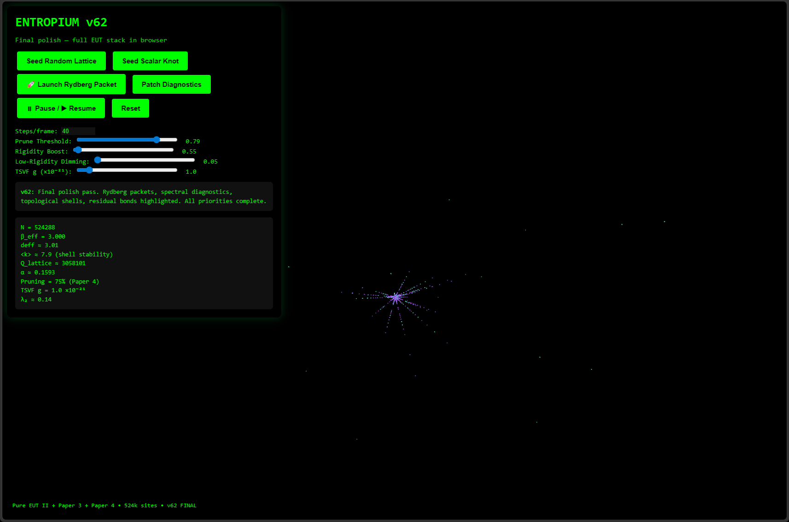

# Entropium

### **Real-time browser visualization of the Entropic Universe Theory (EUT)**

A standalone, single-file interactive demonstration that faithfully implements the full mathematical framework of the Entropic Universe Theory.

It executes the exact native pre-geometric lattice operations from *EUT II* and the scalar knot physics from *Paper 3*, producing stable scalar knots with protected primordial cores, true emergent 3D geometry, localized Rydberg packets, and live spectral diagnostics — all directly from the equations in the papers.

  

<em>Live scalar knot with Rydberg packet (v62)</em>

### Try it now

1. **Download** [`entropium-v62.html`](https://github.com/slashrebootofficial/Entropium/raw/main/entropium-v62.html)
2. Open the file directly in **Google Chrome** or **Microsoft Edge** (latest version)
3. Click **"Seed Scalar Knot"** and watch the theory run live

> **Note:** WebGPU works best when the HTML file is opened from your local filesystem. Online previewers usually block or disable WebGPU for security reasons.

### Features

- Scalar knots with protected primordial cores (Paper 3)
- True emergent 3D geometry via graph Laplacian embedding
- Dynamic \(\beta_{\rm eff}\) relaxation to the rigidity attractor \(\beta = 3\)
- TSVF back-reaction on residual primordial bonds
- Rydberg-style gradient packet injection
- Live diagnostics (\(\beta_{\rm eff}\), \(Q\), coordination number, pruning, etc.)
- Runs entirely in-browser with WebGPU (no installation)

### How to run

1. Download `entropium-v62.html`
2. Open it in **Google Chrome** or **Microsoft Edge** (latest version)
3. Click **"Seed Scalar Knot"** to begin

**Requirements**: WebGPU enabled (default in current Chrome/Edge). \
**Important:** Edge: may need to be enabled manually → [Enable WebGPU in Microsoft Edge](https://enablegpu.com/guides/edge/)

### Related papers

This demo is a computational companion to:

1. [The Entropic Universe: An Effective Field Theory... (v10)](https://doi.org/10.5281/zenodo.17528477)
2. [The Entropic Universe II... (v5)](https://doi.org/10.5281/zenodo.17651888)
3. [Stability of Scalar Knots... (Paper 3)](https://doi.org/10.5281/zenodo.19542399)
4. [Leveraging Simplified Physics Models... (Paper 4)](https://doi.org/10.5281/zenodo.17915437)

### Zenodo record

Full version history and archival copy: [https://zenodo.org/records/19873111](https://zenodo.org/records/19873111)

### License

[Creative Commons Attribution 4.0 International (CC BY 4.0)](LICENSE)

## Contact
matthew@slashreboot.com, @slashreboot on X, https://slashreboot.com

## Citation
If you use this work, please cite the individual papers via their DOIs.

---

Made with precision as a faithful embodiment of the Entropic Universe Theory.
